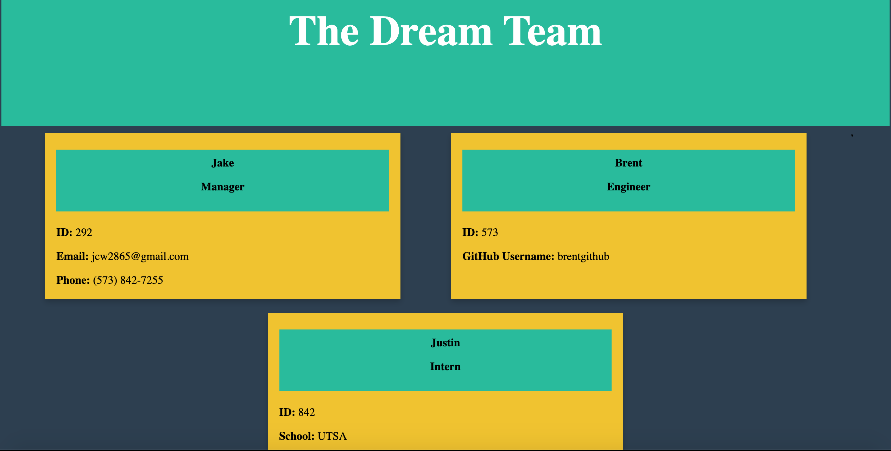

# TeamProfileGenerator
Team Profile Generator

The purpose of this project was to build a command line interface that prompts the user (presumably a manager) for their information as well as information about their employees. The CLI would then take the user's provided information and generate an HTML document. The project user story is below.

```
As a manager
I want to generate a webpage that displays my team's basic info
so that I have quick access to emails and GitHub profiles
```

 The criteria for a successful program are below: 

* Each team member should have the following properties: Name, Role, ID, Role-Specific Property (i.e. GitHub username, school, phone number).

* Following the user's input, an HTML document is created displaying the provided information. 

* The program passes all provided tests. 

## Getting Started

The deployed project should look like this. Click the image to see a video of the deployed project.

[](https://youtu.be/2oFZDTQwhzE)


Below is the link to the project repository followed by the link to the video of the CLI process. 

https://github.com/jcw2865/TeamProfileGenerator

https://youtu.be/2oFZDTQwhzE

### Development

Below are the steps I took to create the program as it is so far. The development of this program was trickier than previous programs because the intent was to use Test-Driven-Development. What was tricky about that was trying to develop the program as I knew it should have been, while also trying to incorporate a new aspect which was developing tests simultaneously (if not the other way around).  

1. Created the initial files (JS files, HTML files, test files). 

2. Downloaded all dependecies using npm. 

3. Created user prompts with inquirer.

4. Created the desired HTML structure and style.

5. Copied and pasted the HTML structure and style into a "generateHTML" function to be called later. 

6. Created "calls" for the user input to be plugged into the generateHTML function. 

## Testing

The tests for this program were provided. The intent of the project was to reach a specific end-state (the HTML document) using the provided tests as a guideline throughout development. While some of the provided tests were successful, others were not. The end-state was reached and an HTML document was created while meeting all of the criteria, but not all of the tests passed, which leads me to believe there are probably better ways to develop and execute this program.

## Deployment

This program can be viewed and deployed using most internet browsers via the links in the "Getting Started" section. 

## Built With

* [VSCode](https://code.visualstudio.com/) - The platform I used for developing this project.
* [MDN](https://developer.mozilla.org/en-US/) - Used as a reference tool.
* [GoogleChrome](https://www.google.com/chrome/) - Used for inspector tool and validating the program during development. 
* [NodePackageManager](https://www.npmjs.com/) - Used to install node modules/dependencies
* [Inquirer](https://www.npmjs.com/package/inquirer) - A collection of common interactive command line user interfaces.
* [YouTube](https://youtube.com) - Used to publish the video of the CLI which can be found in the "Getting Started" section. 
<!-- ## Contributing

Please read [CONTRIBUTING.md](https://gist.github.com/PurpleBooth/b24679402957c63ec426) for details on our code of conduct, and the process for submitting pull requests to us. -->

## Authors

* **Jake Walker** - [jcw2865](https://github.com/jcw2865)

<!-- See also the list of [contributors](https://github.com/your/project/contributors) who participated in this project. -->

<!-- ## License

This project is licensed under the MIT License - see the [LICENSE.md](LICENSE.md) file for details -->

## Acknowledgments

* The advisors, instructors, and TAs at the Coding Bootcamp at the University of Texas at Austin
* Tutoring staff at Trilogy
* Fellow classmates at the Coding Bootcamp at UT-Austin
* Friends in the industry (Brent and Pills, thank you for your timely and tremendous help)